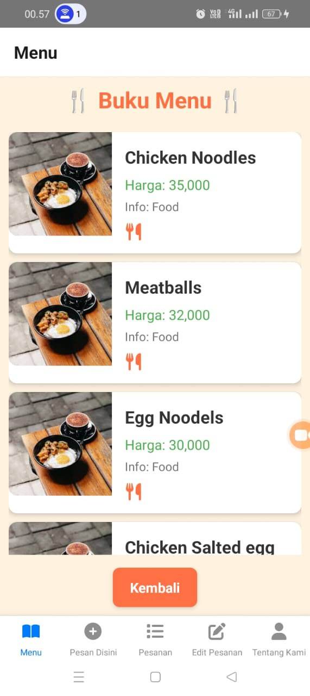
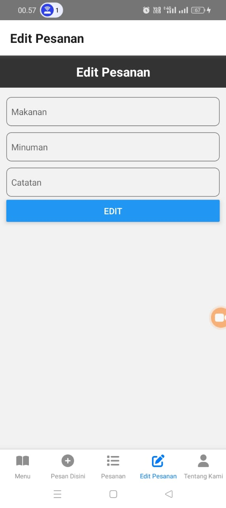
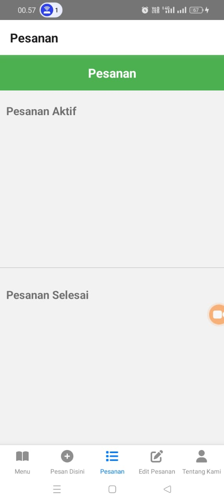

# Nama Produk: Enji's Kitchen

## Deskripsi Produk
Apikasi ini dibuat untuk mempermudah pengunjung dalam melakukan proses pemesanan, Pengunjung juga dapat melihat beberapa menu yang ditawaran oleh Enjis,s Kitchen. Dalam aplikasi tersebut pengunjung juga dapat meihat lihat sejak kapan berdirinya Enji's Kitchen serta adanya peta persebaran cabang restoran juga mempermudah pengunjung dalam mengetahui lokasi restoran.

## Komponen Pembangun Produk
- *React Native*: Framework utama untuk membangun aplikasi mobile.
- *Metro Bundler*: JavaScript bundler bawaan React Native.
- *Node.js*: Untuk mengelola dependensi dan skrip aplikasi.
- *Android Studio & Xcode*: Emulator/simulator untuk pengujian aplikasi di Android dan iOS.
- *Backend/API*: Menggunakan RESTful API untuk pengelolaan data (opsional, sesuai dengan kebutuhan).

## Sumber Data
Aplikasi ini menggunakan data:
- Data daftar menu yang dibuat oleh pribadi.
- Data cabang restoran yang ditambahkan secara pribadi.

## Tangkapan Layar Komponen Penting Produk
### Halaman Utama

### Halaman Input Data

### Halaman List Data

### Halaman Tentang Kami

### Halaman Edit Data

### Halaman Status Pemesanan

